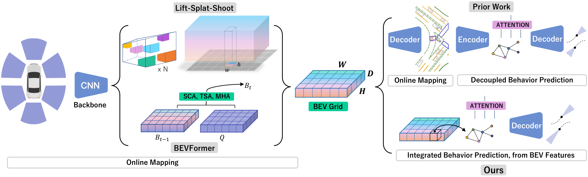

# MapBEVPrediction
This repository contains the official implementation of [Accelerating Online Mapping and Behavior Prediction via Direct BEV Feature Attention](https://arxiv.org/abs/2407.06683) published in ECCV 2024. 



## Citation

If you found this repository useful, please consider citing our work:

```
@Inproceedings{GuSongEtAl2024,
  author    = {Gu, Xunjiang and Song, Guanyu and Gilitschenski, Igor and Pavone, Marco and Ivanovic, Boris},
  title     = {Accelerating Online Mapping and Behavior Prediction via Direct BEV Feature Attention},
  booktitle = {European Conference on Computer Vision (ECCV)},
  year      = {2024}
}
```

## License

This repository is licensed under [Apache 2.0](LICENSE).
